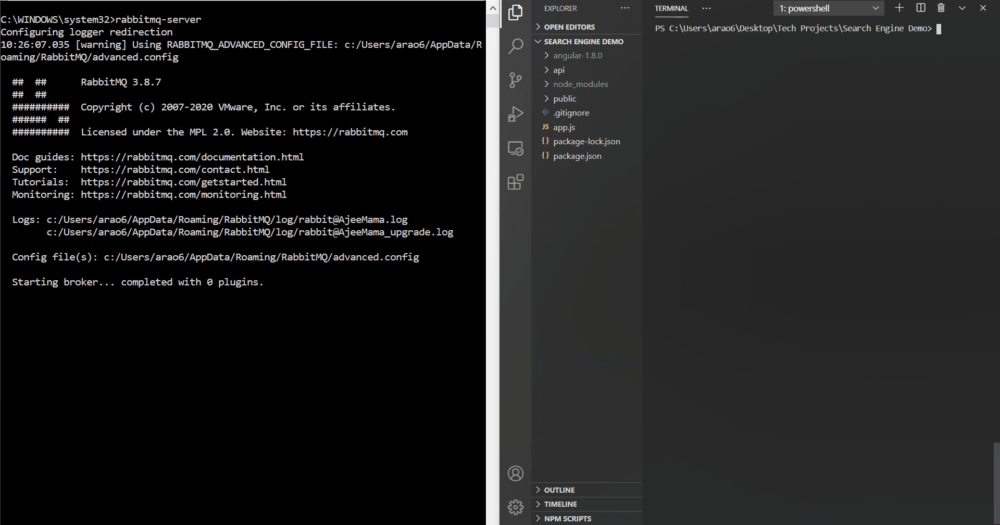

# TED-Search-Engine
<h1> What is it? </h1>
<p> A full text search engine to find TED talks, built using Python and MEAN Stack.</p>


<h1> How to use it </h1>
<ul>
  <li> Clone this repo and install all dependencies (listed below) </li>
  <li> cd to project directory and run the following commands </li>
  
  ```
  >> npm install #install all dependencies listed in package.json
  >> cd api/python-scripts 
  >> python createDB.py #insert video transcripts into mongoDB 
  >> python updateIndex.py #create inverted index from video transcript data
  ```
  <li> Open another command prompt and start a rabbitmq server </li>
  <li> Start the application with nodemon </li>
  
  
</ul>

<h1> Dependecies </h1>
<p><b>Note</b> the application uses Python 3.7.4, Node.js 12.18.3 and mongoDB 4.2.8. The dependencies listed are for Python only,
dependencies for Node js can be installed via npm install </p>


 


